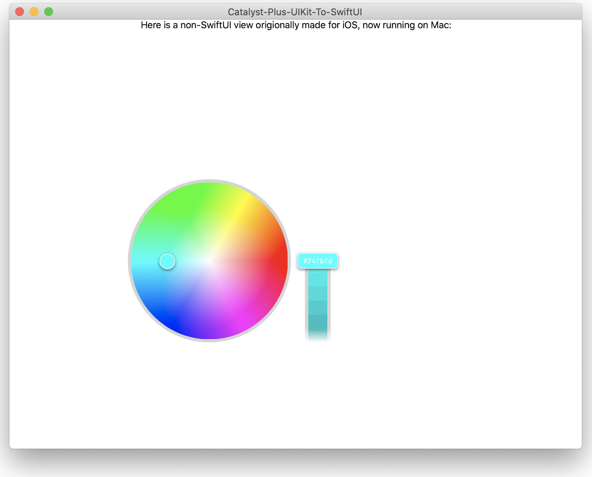

# Catalyst + (UIKit-to-SwiftUI)

How to run code originally written for iOS (UIKit) on macOS (in SwiftUI).

This is what was done here. [Color-Picker-for-iOS](https://github.com/hayashi311/Color-Picker-for-iOS) is one such library only available on iOS and only available in UIKit. Here is how I made it run on macOS in a SwiftUI project:
First- What not to do: 
1) Create a SwiftUI project for macOS
2) Add the code the UIKit files
3) Wrap the the code for use in SwiftUI Views

This will not work because you cannot import UIKit code directly on macOS projects.
So then, what to do?

* Create a project for iOS _instead_, and take advantage of Catalyst to run the project on macOS (check the box for macOS under your project target)

